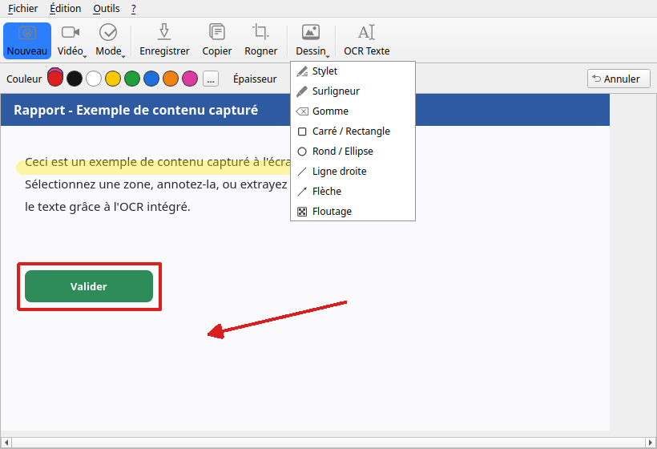
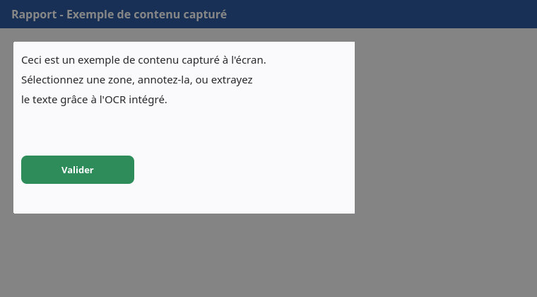
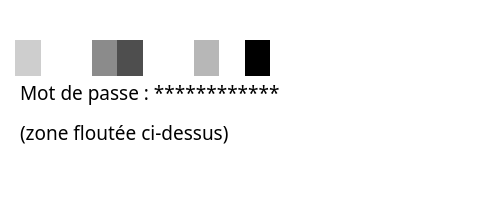
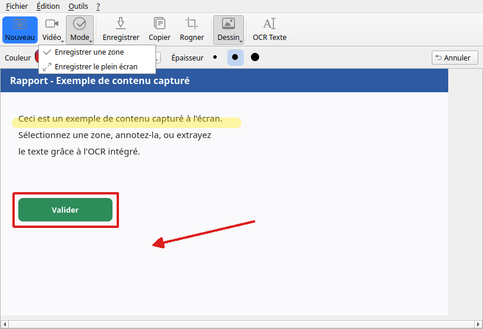
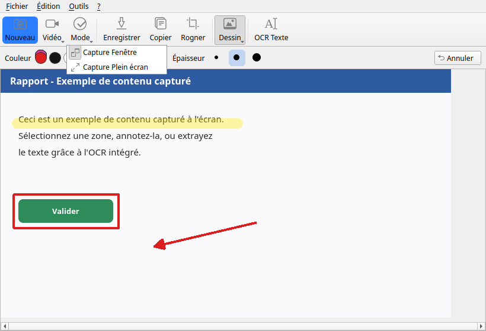
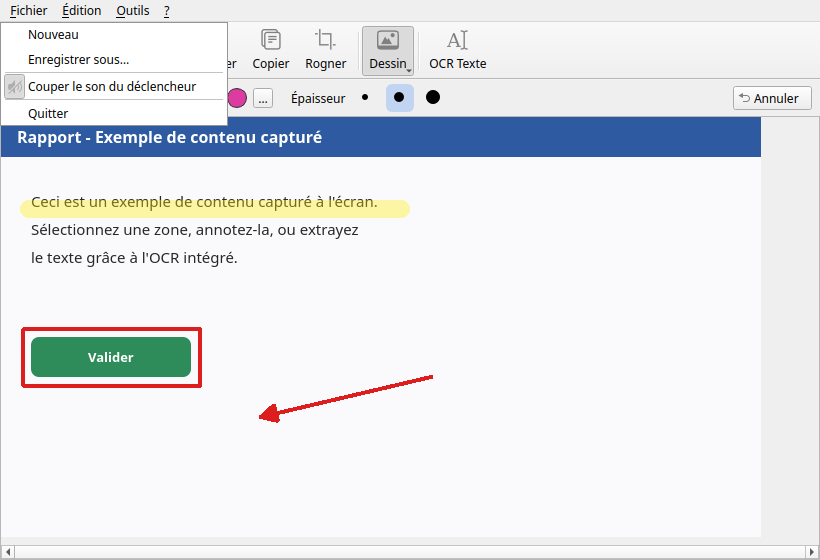
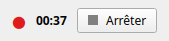

<p align="center">
  
</p>

<h1 align="center">Outil Capture d'écran</h1>

<p align="center">
  <b>L'Outil Capture d'écran de Windows n'existe pas sur Ubuntu — maintenant si.</b><br>
  Capture, OCR, annotation complète et enregistrement vidéo, pensés pour GNOME/Wayland.
</p>

<p align="center">
  
  
  
  
  
</p>

<p align="center">
  
</p>

## Sommaire

- [Présentation](#présentation)
- [Pourquoi ce projet](#pourquoi-ce-projet)
- [Fonctionnalités](#fonctionnalités)
- [Comparatif avec l'Outil Capture d'écran Windows](#comparatif-avec-loutil-capture-décran-windows)
- [Captures d'écran](#captures-décran)
- [Installation](#installation)
- [Configuration](#configuration)
- [Utilisation](#utilisation)
- [Structure du projet](#structure-du-projet)
- [Contribution](#contribution)
- [Roadmap](#roadmap)
- [FAQ](#faq)
- [Licence](#licence)

## Présentation

**Outil Capture d'écran** est une application native Ubuntu (PyQt6, GNOME/Wayland) qui reprend l'esprit de l'Outil Capture d'écran (Snipping Tool) de Windows — sélection rapide, annotation, OCR — sans dépendre de Windows. Le but n'est pas de cloner Windows à l'identique, mais d'offrir une **expérience aussi simple et directe**, adaptée aux usages et à l'environnement Ubuntu : portail `xdg-desktop-portal`, intégration GNOME, icônes du thème système, gestion correcte de Wayland.

Interface pensée pour être prise en main immédiatement : une barre d'outils iconée, un clic sur **Nouveau** pour démarrer, et tout le nécessaire pour capturer, annoter et partager en quelques secondes.

## Pourquoi ce projet

Sous Windows, l'Outil Capture d'écran est intégré, rapide, et suffit à 90 % des besoins du quotidien (partager une erreur, annoter une image, extraire du texte). Sous Ubuntu, rien d'équivalent n'est installé par défaut : les alternatives existantes sont soit trop limitées (une simple capture sans annotation ni OCR), soit trop complexes à configurer. Ce projet comble ce manque avec un outil unique, gratuit, open source, et pensé dès le départ pour Wayland — la session par défaut des Ubuntu récentes.

## Fonctionnalités

### 📸 Capture d'écran
Trois façons de capturer : une fenêtre spécifique, une zone dessinée à la souris, ou l'écran entier. La sélection se fait *avant* la prise de vue (comme sous Windows) — vous voyez exactement ce que vous capturez, sans que l'application n'apparaisse dans le résultat.

### 🔤 OCR — reconnaissance de texte
Le texte détecté par Tesseract (français + anglais) est **directement sélectionnable sur la photo**, à la souris — glissez pour sélectionner, `Ctrl+C` ou clic droit pour copier. Plus simple qu'un panneau de texte séparé.

### ✏️ Annotation complète
Huit outils accessibles depuis le menu **Dessin ▾** : Stylet, Surligneur, Gomme, Rectangle, Ellipse, Ligne droite, Flèche, et Floutage/Pixellisation (pour masquer un mot de passe, un numéro, une donnée sensible avant de partager). Couleur (8 teintes + sélecteur personnalisé) et épaisseur (Fin / Moyen / Épais) réglables à la volée depuis une barre d'options contextuelle, avec Annuler (`Ctrl+Z`).

### ✂️ Rogner
Pas besoin de refaire toute la capture si la sélection initiale n'était pas parfaite : **Rogner** permet de recadrer l'image après coup, avec aperçu en direct (zone conservée en clair, reste assombri) et validation explicite.

### 🎬 Enregistrement vidéo
Enregistrement MP4 d'une zone sélectionnée à la souris **ou du plein écran** (Windows 11 ne propose que la zone rectangulaire) — fichier nommé et horodaté automatiquement dans `~/Vidéos`. Le choix d'écran GNOME n'est demandé qu'une fois : mémorisé pour les enregistrements suivants.

### ⌨️ Raccourci clavier global
Une fois configuré (voir [Configuration](#configuration)), lance une capture depuis n'importe où sur le bureau, sans avoir à ouvrir l'application au préalable.

### 🔇 Confort d'usage
Coupure du son du déclencheur (menu Fichier), fenêtre qui s'ajuste automatiquement à la taille de la capture, flash visuel de confirmation, icône propre dans le dock GNOME.

## Comparatif avec l'Outil Capture d'écran Windows

| | Snipping Tool (Windows) | Outil Capture d'écran (Ubuntu) |
|---|:---:|:---:|
| Capture zone / fenêtre / plein écran | ✅ | ✅ |
| OCR | ✅ (panneau séparé) | ✅ **sélection directe sur la photo** |
| Annotation (stylet, formes, flèche…) | ✅ | ✅ |
| Floutage / pixellisation | ✅ | ✅ |
| Rogner après capture | ✅ | ✅ |
| Enregistrement vidéo | Zone rectangulaire uniquement | Zone **ou plein écran** |
| Raccourci clavier global | ✅ natif | ✅ (une étape de configuration GNOME) |
| Règle pour tracer des lignes parfaitement droites | ✅ | ⏳ voir [Roadmap](#roadmap) |
| Gratuit et open source | ❌ propriétaire | ✅ licence MIT |
| Fonctionne sur Ubuntu | ❌ | ✅ |

## Captures d'écran

<table>
<tr>
<td width="50%">
<b>Fenêtre principale</b><br>
Toolbar iconée, capture annotée, barre d'options de dessin.
<br>
</td>
<td width="50%">
<b>Menu Dessin ▾</b><br>
Les 8 outils d'annotation disponibles.
<br>
</td>
</tr>
<tr>
<td width="50%">
<b>Sélection de texte OCR</b><br>
Le texte détecté se sélectionne directement sur l'image.
<br>
</td>
<td width="50%">
<b>Rogner</b><br>
Aperçu en direct de la zone conservée.
<br>
</td>
</tr>
<tr>
<td width="50%">
<b>Floutage</b><br>
Masquer une information sensible avant de partager.
<br>
</td>
<td width="50%">
<b>Menu Vidéo ▾</b><br>
Enregistrement d'une zone ou du plein écran.
<br>
</td>
</tr>
<tr>
<td width="50%">
<b>Menu Mode ▾</b><br>
Choix du type de capture.
<br>
</td>
<td width="50%">
<b>Menu Fichier</b><br>
Nouveau, Enregistrer sous, coupure du son, Quitter.
<br>
</td>
</tr>
<tr>
<td width="50%">
<b>Enregistrement vidéo en cours</b><br>
Indicateur flottant avec minuteur.
<br>
</td>
<td width="50%"></td>
</tr>
</table>

## Installation

Compatible Ubuntu **22.04**, **24.04** et **26.04** LTS (GNOME).

```bash
git clone https://github.com/moorenchristian-oss/Outil-Capture-d-ecran.git
cd Outil-Capture-d-ecran
./install.sh
```

`install.sh` s'occupe de tout :

1. Détecte la version d'Ubuntu (avertissement non bloquant si hors des versions testées).
2. Installe les paquets système manquants via `apt` (mot de passe demandé si nécessaire) :

   | Paquet | Rôle |
   |---|---|
   | `python3-pyqt6` | Interface graphique (installé via `pip --user` en repli sur Ubuntu 22.04, où ce paquet n'existe pas encore dans les dépôts) |
   | `python3-dbus`, `python3-gi`, `gir1.2-glib-2.0` | Appels aux portails Wayland (capture d'écran, enregistrement vidéo) |
   | `python3-xlib` | Capture d'écran en session X11 (repli ; Wayland est la cible principale) |
   | `tesseract-ocr`, `tesseract-ocr-fra`, `tesseract-ocr-eng` | Reconnaissance de texte (OCR) |
   | `wireplumber` | Coupure du son du déclencheur (`wpctl`) |
   | `gstreamer1.0-tools`, `gstreamer1.0-pipewire`, `gstreamer1.0-plugins-good` | Lecture du flux PipeWire pour l'enregistrement vidéo |

3. Ajoute **Outil Capture d'écran** au menu des applications Ubuntu, avec son icône.
4. Crée un lanceur en ligne de commande : `~/.local/bin/outil-capture-decran`.

Le script est **idempotent** : le relancer ne réinstalle que ce qui manque, sans risque.

Une fois installé, l'application apparaît dans le menu des applications comme n'importe quel logiciel Ubuntu.

## Configuration

### Couper le son du déclencheur
Menu **Fichier → Couper le son du déclencheur** (case à cocher).

### Raccourci clavier global

GNOME/Wayland ne permet pas à une application de réagir à un raccourci tant qu'elle n'est pas déjà lancée (contrairement à Windows). La solution : un raccourci personnalisé GNOME qui lance l'application directement en mode capture.

1. **Paramètres** → **Clavier** → **Voir et personnaliser les raccourcis** → **Raccourcis personnalisés** → **+**
2. Nom : `Capture d'écran`
3. Commande : `outil-capture-decran --capture` (chemin complet si besoin : `/home/<utilisateur>/.local/bin/outil-capture-decran --capture`)
4. Associer la combinaison de touches souhaitée (ex. `Ctrl+Maj+S`)

Une fois configuré, ce raccourci fonctionne depuis n'importe où sur le bureau.

## Utilisation

### Prendre une capture
1. Choisir un mode dans **Mode ▾** (Fenêtre ou Plein écran), puis cliquer **Nouveau**.
2. En mode zone/fenêtre, dessiner la sélection à la souris — la photo est prise juste après.
3. La fenêtre principale s'affiche automatiquement avec le résultat, dimensionnée à la taille de l'image.

### Annoter
1. Ouvrir **Dessin ▾** et choisir un outil.
2. Ajuster couleur et épaisseur dans la barre qui apparaît sous la toolbar.
3. Dessiner directement sur l'image. `Ctrl+Z` pour annuler une étape.

### Extraire du texte (OCR)
1. Cliquer **OCR Texte** (sur une capture existante, ou directement — une nouvelle capture sera demandée).
2. Glisser la souris sur le texte à copier, `Ctrl+C` ou clic droit → Copier.

### Rogner
1. Cliquer **Rogner**, glisser pour définir la zone à conserver (la zone hors sélection s'assombrit).
2. **Valider le rognage** ou **Annuler**.

### Flouter une information sensible
1. Choisir **Floutage** dans **Dessin ▾**.
2. Glisser sur la zone à masquer — le texte/contenu devient illisible (pixellisé), la taille du pixel se règle avec Fin/Moyen/Épais.

### Enregistrer une vidéo
1. Cliquer **Vidéo ▾** → **Enregistrer une zone** (sélection à la souris) ou **Enregistrer le plein écran**.
2. Choisir l'écran à partager dans la boîte de dialogue système GNOME (une seule fois, mémorisé ensuite).
3. Un indicateur flottant affiche la durée ; cliquer **Arrêter** pour terminer. Le fichier MP4 est enregistré automatiquement dans `~/Vidéos`.

### Enregistrer / copier le résultat
**Enregistrer** (PNG, avec choix de l'emplacement) ou **Copier** (presse-papiers, prêt à coller).

## Structure du projet

```
main.py               Point d'entrée (gère aussi --capture pour le raccourci global)
ui/                    Fenêtre principale, sélection OCR, barre d'options de dessin, widgets (PyQt6)
capture/               Capture d'écran (X11 / portail Wayland), enregistrement vidéo, sélecteur de zone, son
ocr/                   Moteur OCR (Tesseract)
annotation/            Outils de dessin, rognage et floutage sur la capture (QPainter)
clipboard/             Presse-papiers (texte / image)
database/              Historique des captures (SQLite)
data/icons/            Icône de l'application et icônes de la barre d'outils
docs/                  Documentation complémentaire et captures d'écran
```

Voir aussi [PLAN.md](PLAN.md), [MEMOIRE.md](MEMOIRE.md) et [SCHEMA.md](SCHEMA.md) pour l'historique et le détail de l'architecture, et [docs/DEVELOPMENT.md](docs/DEVELOPMENT.md) pour le développement local.

## Contribution

Les contributions sont bienvenues, qu'il s'agisse d'un correctif, d'une nouvelle fonctionnalité ou d'une amélioration de la documentation.

1. Forkez le dépôt et créez une branche depuis `master` (`git checkout -b ma-fonctionnalite`).
2. Faites vos modifications en gardant le style existant (pas de dépendance ajoutée sans raison, pas de fichier `.desktop`/venv — le projet reste 100 % apt).
3. Vérifiez que l'application se lance sans erreur (`python3 main.py`) avant de proposer votre changement.
4. Ouvrez une Pull Request en décrivant le problème résolu ou la fonctionnalité ajoutée.

Une idée, un bug ? Ouvrez une [issue](../../issues) — captures d'écran et étapes de reproduction sont toujours utiles.

## Roadmap

Pistes connues, non implémentées à ce jour :

- 📏 Règle pour tracer des lignes/flèches parfaitement droites (à la manière du Snipping Tool Windows).
- 🔤 Outil Texte (ajouter une légende directement sur l'image).
- 🖱️ Numérotation automatique (bulles numérotées pour des tutoriels pas à pas).
- 🗂️ Historique des captures consultable depuis l'application.

## FAQ

**Pourquoi la première capture/vidéo me demande une autorisation système ?**
C'est le portail `xdg-desktop-portal` de Wayland qui protège l'accès à l'écran — aucune application, y compris celle-ci, ne peut capturer l'écran sans une confirmation explicite. Pour les captures photo, la demande est silencieuse une fois autorisée ; pour la vidéo, GNOME redemande l'écran à partager mais mémorise ensuite le choix.

**Ça fonctionne en session X11 ?**
Oui, avec un repli automatique sur `python3-xlib`/`mss`, mais Wayland (la session par défaut d'Ubuntu) est la cible principale et la mieux testée.

**Où sont enregistrées mes captures et vidéos ?**
Les captures se choisissent à l'enregistrement (par défaut `~/Images`) ; les vidéos sont automatiquement horodatées dans `~/Vidéos`.

**Pourquoi pas de version Windows/macOS ?**
Le projet répond spécifiquement au manque d'un tel outil sur Ubuntu — l'intégration (portails Wayland, thème d'icônes GNOME, PipeWire) est pensée pour cet environnement précis.

**Mes données sont-elles envoyées quelque part ?**
Non. Tout (capture, OCR, vidéo) se passe localement sur votre machine ; aucune connexion réseau n'est utilisée par l'application.

## Licence

Distribué sous licence MIT — voir [LICENSE](LICENSE).
