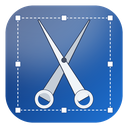
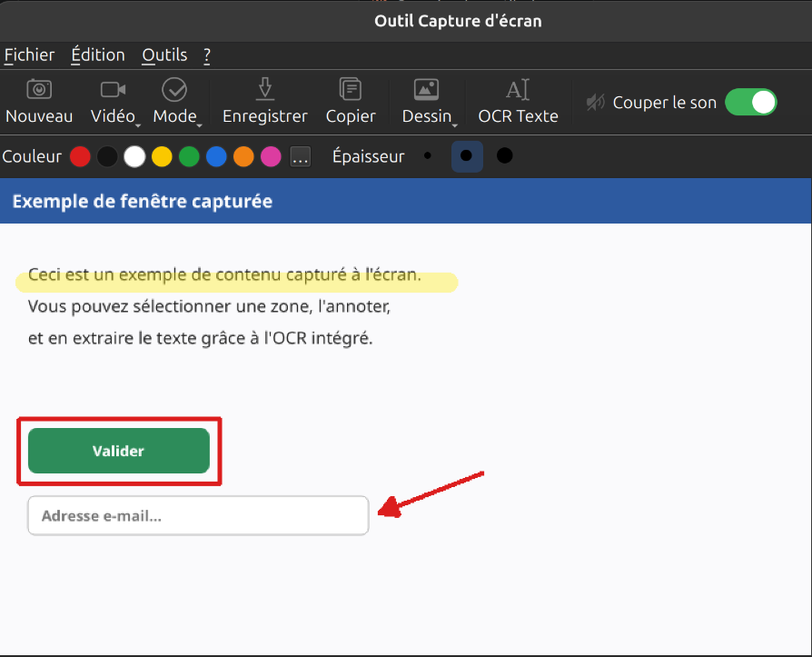
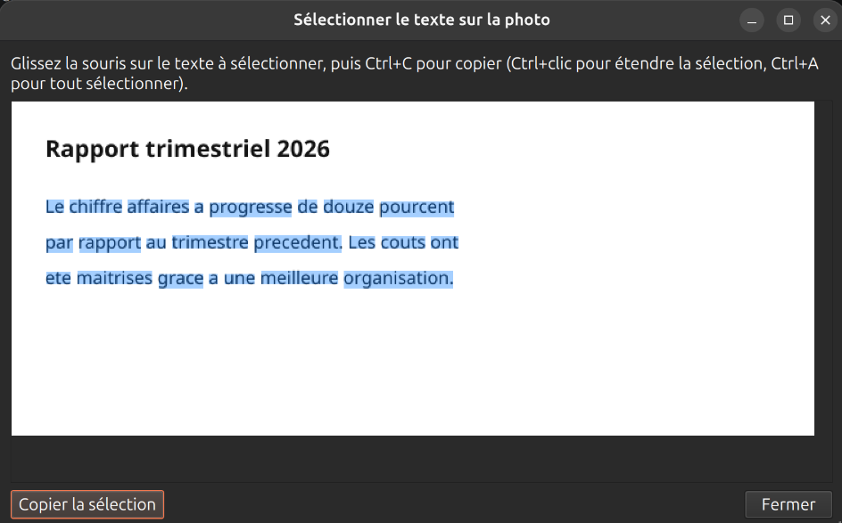

<p align="center">
  
</p>

<h1 align="center">Outil Capture d'écran</h1>

<p align="center">
  Capture d'écran façon Windows Snipping Tool pour Ubuntu — sélection de zone à la souris,
  OCR avec sélection de texte directement sur l'image, annotation complète et enregistrement vidéo.
</p>

<p align="center">
  
  
  
  
</p>

## Aperçu

<p align="center">
  
</p>

<p align="center">
  
</p>

## Fonctionnalités

- **Capture d'écran** en session X11 ou Wayland (portail `xdg-desktop-portal`), avec sélection de zone à la souris avant la prise de vue, capture d'une fenêtre ou du plein écran.
- **OCR (reconnaissance de texte)** via Tesseract : le texte détecté peut être sélectionné directement sur l'image avec la souris, puis copié (`Ctrl+C` ou clic droit).
- **Annotation complète** : Stylet, Surligneur, Gomme, Rectangle, Ellipse, Ligne droite, Flèche — couleur et épaisseur (Fin/Moyen/Épais) réglables depuis une barre d'options, et Annuler (`Ctrl+Z`).
- **Enregistrement vidéo** MP4 d'une zone sélectionnée à la souris ou du plein écran, nommé automatiquement par date et heure.
- **Copier / Enregistrer** la capture annotée en PNG.
- **Coupure du son du déclencheur** pendant la capture, activable via un bouton coulissant dans la barre d'outils.

## Installation (Ubuntu)

```bash
git clone <url-du-dépôt>
cd "Outil Capture d'écran"
./install.sh
```

Le script installe les paquets système manquants via `apt` (avec demande de mot de passe si nécessaire), ajoute "Outil Capture d'écran" au menu des applications Ubuntu avec son icône, et crée un lanceur en ligne de commande (`~/.local/bin/outil-capture-decran`). Il est sûr à relancer plusieurs fois.

Détails des dépendances et du lancement en mode développement : voir [docs/DEVELOPMENT.md](docs/DEVELOPMENT.md).

## Utilisation

1. Cliquer sur **Nouveau** (ou choisir un mode dans le menu **Mode**), sélectionner la zone à capturer à la souris (sauf en mode Plein écran).
2. Annoter la capture depuis la barre d'outils **Dessin** — couleur, épaisseur et Annuler apparaissent dans la barre juste au-dessus de l'image.
3. Copier, enregistrer, ou lancer l'**OCR Texte** pour sélectionner et copier du texte directement sur la photo.
4. Cliquer sur **Vidéo** pour enregistrer une zone sélectionnée à la souris ou le plein écran ; le fichier MP4 est enregistré automatiquement dans `~/Vidéos`.

## Structure du projet

```
main.py               Point d'entrée de l'application
ui/                    Fenêtre principale, sélection OCR, barre d'options de dessin, widgets (PyQt6)
capture/               Capture d'écran (X11 / portail Wayland), enregistrement vidéo, sélecteur de zone, son
ocr/                   Moteur OCR (Tesseract)
annotation/            Outils de dessin sur la capture (QPainter)
clipboard/             Presse-papiers (texte / image)
database/              Historique des captures (SQLite)
data/icons/            Icône de l'application et icônes de la barre d'outils
```

Voir aussi [PLAN.md](PLAN.md), [MEMOIRE.md](MEMOIRE.md) et [SCHEMA.md](SCHEMA.md) pour le détail de l'architecture.

## Licence

Distribué sous licence MIT — voir [LICENSE](LICENSE).
