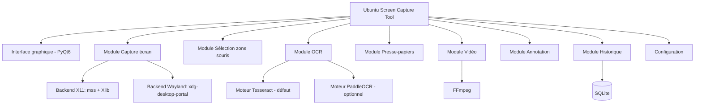
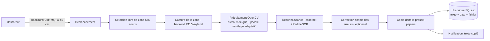
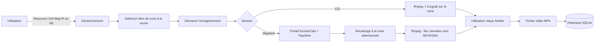
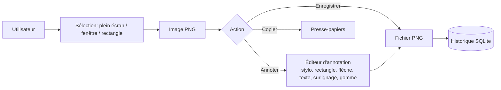

# Schéma d'architecture — Ubuntu Screen Capture Tool

## Arborescence des modules



## Flux 1 — Capture + OCR + presse-papiers (priorité #1 et #2)



## Flux 2 — Enregistrement vidéo d'une zone (priorité #3)



## Flux 3 — Capture image simple / annotation



## Wireframe — Fenêtre principale

```
+--------------------------------+
|  Ubuntu Screen Capture         |
|                                 |
|  [ Capture Image ]              |
|  [ OCR Texte ]                  |
|  [ Enregistrer Vidéo ]          |
|  [ Historique ]                 |
|  [ Paramètres ]                 |
+--------------------------------+
```

## Voir aussi

- [PLAN.md](PLAN.md) — plan d'implémentation par étapes.
- [MEMOIRE.md](MEMOIRE.md) — objectifs, priorités et justification des choix techniques.
